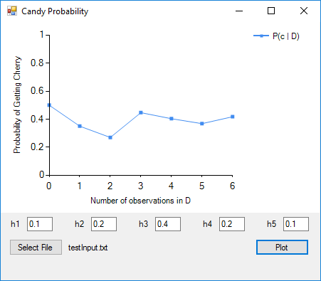

# Bayes-Candy

This project is a Windows Form application that models Bayesian Learning through the Candy problem, which is explained [here](https://ocw.mit.edu/courses/health-sciences-and-technology/hst-950j-biomedical-computing-fall-2010/lectures-and-readings/MITHST_950JF10_lec17.pdf) (page 4).

## Minimum Software Requirements

- Visual Studio 2010 SP1 (to build the executable)
- .NET 3.0 ([release](link))

## Building

To build the application in Visual Studio:

1. Launch Visual Studio

2. Open the solution: **File->Open->Project/Solution->.../Bayes-Candy.sln**

3. Build the project: **Build->Build Solution**

4. Check your build configuration: **Build->Configuration Manager**
  * If your Configuration is Debug, then the .exe will be located in Bayes-Candy/bin/Debug/Bayes-Candy.exe
  * If your configuration is Release, then the .exe will be located in Bayes-Candy/bin/Debug/Bayes-Candy.exe

## Screenshots and Instructions

# 

# 
