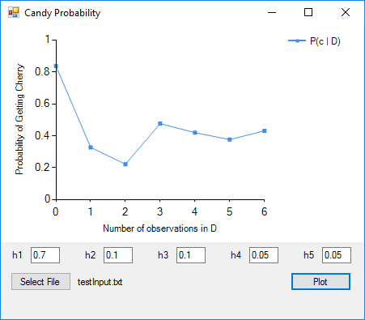

# Bayes-Candy

This project is a Windows Form application that models Bayesian Learning through the candy problem, which is explained [here](https://ocw.mit.edu/courses/health-sciences-and-technology/hst-950j-biomedical-computing-fall-2010/lectures-and-readings/MITHST_950JF10_lec17.pdf) (page 4). This application specifically answers the question, *"What is the probability that a cherry-flavored candy is pulled, given the observation and hypotheses?"*

## Minimum Software Requirements

- Visual Studio 2010 SP1 (to build the executable)
- .NET 3.0

## Release 

[v1.0](link)

## Building

To build the application in Visual Studio:

1. Launch Visual Studio

2. Open the solution: **File->Open->Project/Solution->.../Bayes-Candy.sln**

3. Build the project: **Build->Build Solution**

4. Check your build configuration: **Build->Configuration Manager**
  * If your Configuration is Debug, then the .exe will be located in Bayes-Candy/bin/Debug/Bayes-Candy.exe
  * If your configuration is Release, then the .exe will be located in Bayes-Candy/bin/Debug/Bayes-Candy.exe

## Screenshots and Instructions

# 

On launching the application, you will see the screen above. Create a .txt file that consists of line-delimited `c` or `l` characters, based on the observations that you want to test. A example test file (testInput.txt) is provided in the repository.

# 

After you create your .txt file, return to the application and press "Select File". Then, select your .txt file and press "Plot". You will see a graph that models the probability that the next-picked candy will be cherry-flavored over each observation point. Using the example above, the probability of getting a cherry-flavored candy is 0.35, after observing that the first candy was lime-flavored.

# 

You can change the default probability settings for the hypotheses as you like. In any event, the sum probability of all the hypotheses must equal 1.

*Note* - The following is a reference for the significance of each hypothesis.

- h1: 100% cherry
- h2: 75% cherry, 25% lime
- h3: 50% cherry, 50% lime
- h4: 25% cherry, 75% lime
- h5: 100% lime
